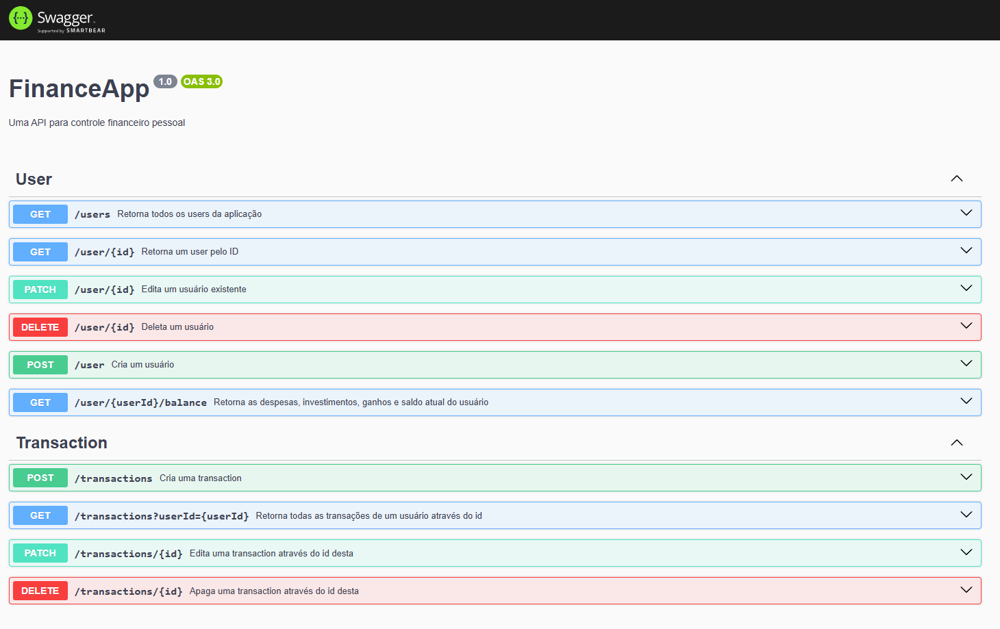

# FinanceApp

**FinanceApp** é uma API para controle financeiro pessoal. Permite gerenciar usuários e transações financeiras de forma simples e eficiente.

## Requisitos

- [Node.js](https://nodejs.org/) versão 18 ou superior
- [Docker](https://www.docker.com/get-started)
- [Docker Compose](https://docs.docker.com/compose/install/)

## Instalação

1. **Instale as dependências:**

   ```bash
   npm install
   ```

2. **Configure as variáveis de ambiente** copiando o arquivo `.env.example` para `.env` e preenchendo com os valores apropriados.

3. **Inicie o banco de dados e a aplicação com Docker:**

   ```bash
   npm run docker
   ```

4. **Execute o Prisma:**

   ```bash
   npm run prisma-init
   ```

5. **Inicie o servidor em modo de desenvolvimento:**

   ```bash
   npm run dev
   ```

### Swagger

- **Rota para a documentação da API**:
  - `GET/docs`
    

<!-- ## Endpoints da API

### Usuários

- **GET /users**

  - **Resumo**: Retorna todos os usuários.

- **GET /user/:id**

  - **Resumo**: Retorna um usuário pelo ID.
  - **Parâmetros**:
    - `id` (path): ID do usuário.

- **GET /user/:userId/balance**

  - **Resumo**: Retorna as despesas, investimentos, ganhos e saldo atual do usuário.
  - **Parâmetros**:
    - `userId` (path): ID do usuário.

- **POST /user**

  - **Resumo**: Cria um novo usuário.
  - **Corpo da Requisição**:
    ```json
    {
      "firstName": "daniel",
      "lastName": "harrison",
      "email": "harrison@gmail.com",
      "password": "123456"
    }
    ```

- **PATCH /user/:id**

  - **Resumo**: Edita um usuário existente.
  - **Parâmetros**:
    - `id` (path): ID do usuário.
  - **Corpo da Requisição**: Pode conter nenhum campo ou vários.

- **DELETE /user/:id**
  - **Resumo**: Deleta um usuário.
  - **Parâmetros**:
    - `id` (path): ID do usuário.

### Transações

- **POST /transactions**

  - **Resumo**: Cria uma nova transação.
  - **Corpo da Requisição**:
    ```json
    {
      "name": "teste",
      "user_id": "40ad7d59-6dbf-47d1-b8ec-f42417441732",
      "date": "2024-12-19T18:45:01.906Z",
      "amount": 200.0,
      "type": "INVESTMENT"
    }
    ```

- **GET /transactions/:userId**

  - **Resumo**: Retorna todas as transações de um usuário pelo ID.
  - **Parâmetros**:
    - `userId` (path): ID do usuário.

- **PATCH /transactions/:id**

  - **Resumo**: Edita uma transação pelo ID.
  - **Parâmetros**:
    - `id` (path): ID da transação.
  - **Corpo da Requisição**: Pode conter nenhum campo ou vários.

- **DELETE /transactions/:id**
  - **Resumo**: Deleta uma transação pelo ID.
  - **Parâmetros**:
    - `id` (path): ID da transação. -->

## Schemas

- **User**

  ```json
  {
    "type": "object",
    "properties": {
      "id": { "type": "string", "description": "ID do usuário" },
      "firstName": { "type": "string", "description": "Primeiro nome" },
      "lastName": { "type": "string", "description": "Último nome" },
      "email": { "type": "string", "description": "Email do usuário" },
      "password": { "type": "string", "description": "Senha do usuário" }
    }
  }
  ```

- **Transaction**

  ```json
  {
    "type": "object",
    "properties": {
      "id": { "type": "string", "description": "ID da transação" },
      "user_id": { "type": "string", "description": "ID do usuário" },
      "name": { "type": "string", "description": "Nome da transação" },
      "date": {
        "type": "string",
        "format": "date-time",
        "description": "Data da transação"
      },
      "amount": { "type": "number", "description": "Valor da transação" },
      "type": {
        "type": "string",
        "enum": ["EARNING", "EXPENSE", "INVESTMENT"],
        "description": "Tipo da transação"
      }
    }
  }
  ```

## Contribuição

Contribuições são bem-vindas! Para contribuir com o projeto, por favor, siga as diretrizes de contribuição descritas no arquivo `CONTRIBUTING.md`.
